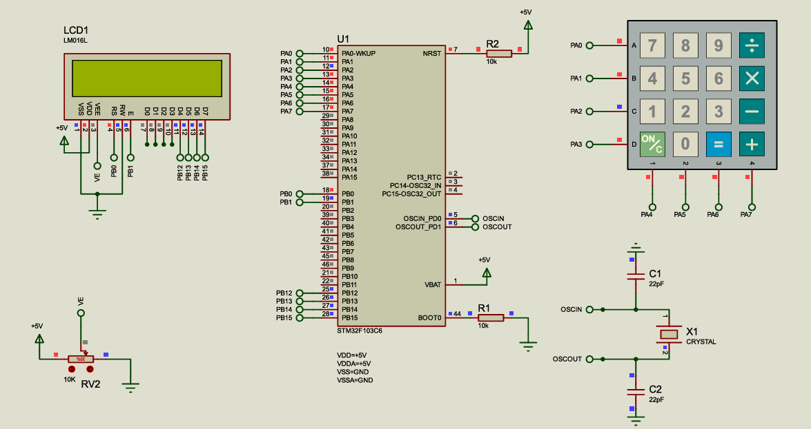

# STM32 Keypad to LCD Interface
Welcome to the STM32 Keypad-LCD Interface project! This repository demonstrates how to interface a 4x4 matrix keypad with a 16x2 Character LCD using the STM32F103C6 microcontroller.

Whether you're building a calculator, a security system, or just learning the ropes of GPIO polling and 4-bit LCD communication, this project serves as a solid foundation.

##  Project Overview
The goal of this project is to create a seamless user input interface. The system polls a 4x4 matrix keypad and instantly reflects the pressed keys onto a 16x2 LCD display. It handles debouncing and includes a specific "Clear" function to reset the display, providing a smooth user experience.

##  Hardware Components
Microcontroller: STM32F103C6 (ARM Cortex-M3)

Display: 16x2 Character LCD (LM016L)

Input: 4x4 Matrix Keypad

Others: 10kΩ Potentiometer , 8MHz Crystal, and decoupling capacitors.

##  Key Features
4-Bit LCD Control: Optimized pin usage by driving the LCD in 4-bit mode rather than 8-bit.

Keypad Polling & Debouncing: A robust scanning algorithm that identifies key presses and releases while filtering out mechanical noise.

Custom Commands: Implemented a special 'C' key function that clears the screen and resets the cursor position.

Modular Code: The project is organized into dedicated drivers (lcd.c/h and keypad.c/h), making it easy to port these libraries to other STM32 projects.

## Technical Highlights
Keypad: Connected to GPIOA. Rows are configured as Outputs, and Columns are configured as Inputs with Pull-Up resistors.

LCD: Connected to GPIOB. Control pins (RS, EN) and Data pins (D4-D7) are mapped to facilitate 4-bit communication.

##  Circuit Schematic
To help with the hardware setup, here is the schematic designed and tested in Proteus. This shows the specific pin mapping for the STM32F103C6, the LCD's 4-bit connection, and the keypad matrix.

 **Note:** Ensure the 10k pull-up resistors on the keypad columns and the contrast potentiometer (RV2) for the LCD are connected as shown to ensure reliable operation.
 
###  Simulation
Create the Proteus project and point the STM32 component to the .hex file in the assets folder to see it in action!  
##  Contributing
I built this project to explore embedded I/O interfacing, and I’d love to hear your thoughts!

Found a bug? Open an Issue.
